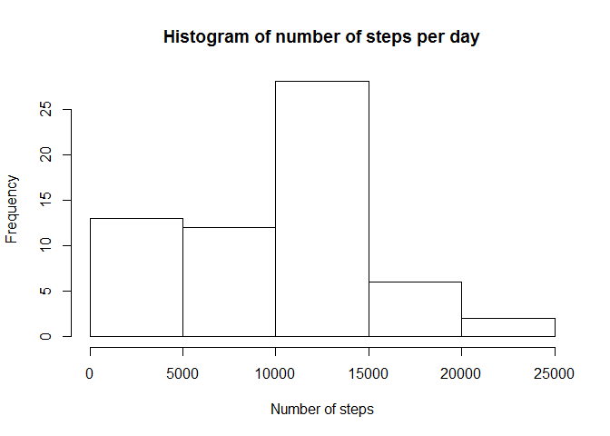
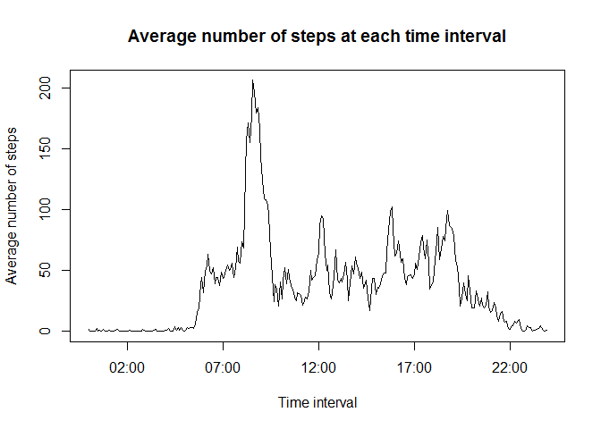
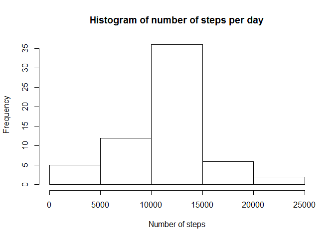
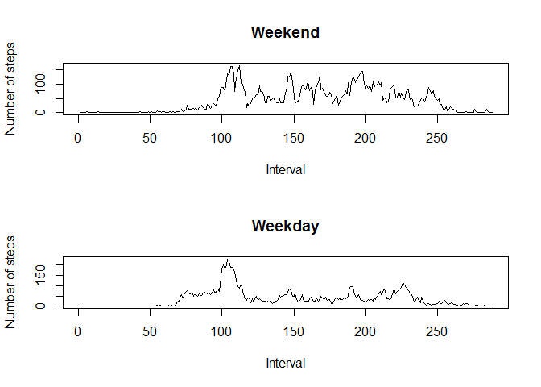

# Analysis of activity monitoring data


## Loading the data

The following code was used to upload the data in the csv file:


```r
## Read data
  ActivityDataSet<- read.csv("activity.csv", colClasses = "character")
```

## Process data

The following code was used to process the data into a suitable form for the analysis:


```r
   ##Convert dates into the correct format
  ActivityDataSet$dates <- as.Date(strftime(ActivityDataSet$date, "%Y-%m-%d"))
  
  ##Convert times into the correct format
  ActivityDataSet$interval <- as.numeric(ActivityDataSet$interval)
  ActivityDataSet$interval <- substr(as.POSIXct(sprintf("%04.0f", ActivityDataSet$interval), format='%H%M'), 12, 16)
  
  ##COnvert steps into numeric format
  ActivityDataSet$steps <- as.numeric(ActivityDataSet$steps)
```

## Total number of steps per day

The following code was used to find the total number of steps on each day


```r
  ##Create a table of the number of steps per day
  SumSteps<-aggregate(ActivityDataSet$steps, by=list(Category=ActivityDataSet$date), FUN=sum, na.rm=TRUE)
```

## Histogram of the number of steps taken per day


```r
 hist(SumSteps$x,main="Histogram of number of steps per day",xlab="Number of steps")
```

<!-- -->

## Mean and median of the number of steps taken per day

The mean number of steps per day is 9354.23

```r
  ##Find the mean number of steps  per day
  mean(SumSteps$x) ##9354.23
```

```
## [1] 9354.23
```
The median number of steps per day is 10395

```r
  ##Find the median number of steps  per day
  median(SumSteps$x) #10395
```

```
## [1] 10395
```

## Average daily activity pattern

Code needed to prepare the plot


```r
##Create a table of the mean number of steps across each 5 minute interval
  MeanStepsperInterval<-aggregate(ActivityDataSet$steps, by=list(Category=ActivityDataSet$interval), FUN=mean, na.rm=TRUE)
##For plotting purposes add a field containing an arbitrary date
  MeanStepsperInterval$Date <- as.Date("2000-01-01")
  ##For plotting purposes create new date time field
  MeanStepsperInterval$DateTime <- as.POSIXct(paste(MeanStepsperInterval$Date, MeanStepsperInterval$Category), format="%Y-%m-%d %H:%M")
```


```r
 ##plot a time-series for average number of steps at each time period  
  plot(MeanStepsperInterval$DateTime, MeanStepsperInterval$x, type = "l",main="Average number of steps at each time interval",xlab="Time interval",ylab="Average number of steps")
```

<!-- -->

The interval with the average number of steps is 08:35 :


```r
 ##Find the interval with the highest average steps
  MeanStepsperInterval$Category[which(MeanStepsperInterval$x==max(MeanStepsperInterval$x))]
```

```
## [1] "08:35"
```

## Imputing missing values

##Total number of missing values in the dataset

The total number of missing values in the dataset is 2304:

```r
 ##Create a vector with the number of NA records, and find the length of the vector 
  NAVector <- ActivityDataSet$steps[is.na(ActivityDataSet$steps)]
  length(NAVector) #Returns 2304
```

```
## [1] 2304
```

##Strategy for imputing missing values
Fill in the NA values for steps using the average of that particular interval.

```r
##Create a new variable in ActivityDataSet giving the mean number of for that particular interval
  ActivityDataSet$MeanSteps<-MeanStepsperInterval[match(ActivityDataSet$interval, MeanStepsperInterval$Category),2]
  
  ##Populate the steps variable with this mean if the value is currently na.
  ActivityDataSet$steps[is.na(ActivityDataSet$steps)]<-ActivityDataSet$MeanSteps[is.na(ActivityDataSet$steps)]
```

## Histogram of total steps taken each data after imputation


```r
##Create a table of the number of stpes per day
  SumSteps<-aggregate(ActivityDataSet$steps, by=list(Category=ActivityDataSet$date), FUN=sum, na.rm=TRUE)

 ##Create a histogram of the number of steps per day
  hist(SumSteps$x,main="Histogram of number of steps per day",xlab="Number of steps")
```

<!-- -->

##Mean and median values for the imputed datastep

The mean number of steps per dat for the imputed datastp is 10766.19

```r
  ##Find the mean number of steps  per day
  mean(SumSteps$x) ##10766.19
```

```
## [1] 10766.19
```
  
The median number of steps per dat for the imputed datastp is 10766.19

```r
  ##Find the median number of steps  per day
  median(SumSteps$x) #10766.19 
```

```
## [1] 10766.19
```
Both the median and mean are larger after imputing the missing values
 
##Differences in activity patterns between weekdays and weekends

##New variable to indicate whether the day is in the week or a weekday

```r
  ##Create a variable that gives the day of the week that the data is for
  ActivityDataSet$Weekday <- weekdays(ActivityDataSet$dates)
  
  
  ##Create a variable that states whether the day is a weekday or weekend
  ActivityDataSet$Weekend <- "Weekday"
  ActivityDataSet$Weekend[ActivityDataSet$Weekday=="Sunday"]<-"Weekend"
  ActivityDataSet$Weekend[ActivityDataSet$Weekday=="Saturday"]<-"Weekend"
```
  ##Plot of average number of steps taken for weekends and weekdays

```r
  ##Create a table of the mean number of steps across each 5 minute interval for weekdays only
  MeanStepsperIntervalWeekday<-aggregate(ActivityDataSet$steps[ActivityDataSet$Weekend=="Weekday"], by=list(Category=ActivityDataSet$interval[ActivityDataSet$Weekend=="Weekday"]), FUN=mean, na.rm=TRUE)
  
  ##Create a table of the mean number of steps across each 5 minute interval for weekends only
  MeanStepsperIntervalWeekend<-aggregate(ActivityDataSet$steps[ActivityDataSet$Weekend=="Weekend"], by=list(Category=ActivityDataSet$interval[ActivityDataSet$Weekend=="Weekend"]), FUN=mean, na.rm=TRUE)
  
  par(mfrow=c(2,1))
  plot(MeanStepsperIntervalWeekend$x, type = "l", main="Weekend",ylab="Number of steps",xlab="Interval")
  plot(MeanStepsperIntervalWeekday$x, type = "l", main="Weekday",ylab="Number of steps",xlab="Interval")
```

<!-- -->
